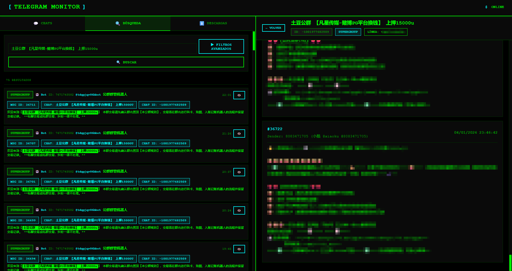

# Telegram-Monitor

Sistema completo para **monitorizar Telegram** (tiempo real + histórico), **persistir mensajes en PostgreSQL** y gestionar una **cola de descargas de media**.

## Captura



- UI (React): `http://localhost:3000`
- API (FastAPI): `http://localhost:8000`
- Healthcheck: `GET http://localhost:8000/health`

> Documentación ampliada:
> - Docker/Compose: `DOCKER_README.md`
> - Arquitectura + modelo de datos + flujos: `SISTEMA_COMPLETO.md`

---

## Arquitectura (resumen)

```text
Telegram (MTProto)
   │
   ▼
telegram-client-N (Telethon)
   ├─ ingesta mensajes (real time + catch-up)
   ├─ persiste chats/senders/messages en PostgreSQL
   ├─ encola descargas en download_queue
   └─ descarga media al filesystem
         │
         ├─ PostgreSQL
         └─ /app/media_downloads/<account_phone>/<chat_id>/<media_type>/...

fastapi-api
   ├─ consulta PostgreSQL
   └─ sirve media desde /app/media_downloads

react-ui2
   └─ consume fastapi-api (polling)
```

Servicios (Compose):
- `postgres` (contenedor: `telegram-db`)
- `telegram-client-1` (contenedor: `telegram-client-1`)
- `telegram-api-gest` (contenedor: `telegram-api-gest`)
- `telegram-front-gest` (contenedor: `telegram-front-gest`)
- `telegram-init` (perfil `init`, interactivo para generar `TG_SESSION_STRING`)

---

## Requisitos

- Docker Desktop (Windows) con `docker compose` (v2)
- Credenciales Telegram API: `TG_API_ID` / `TG_API_HASH` (https://my.telegram.org/apps)

---

## Arranque rápido (Docker Compose)

### 1) Crear `.env` (compartido)

En la raíz del repo, crea un archivo `.env`:

```env
# Telegram API
TG_API_ID=<tu_api_id>
TG_API_HASH=<tu_api_hash>

# Postgres
POSTGRES_DB=telegram_monitor
POSTGRES_USER=telegram
POSTGRES_PASSWORD=<tu_password>
POSTGRES_PORT=5432

# Base URL que usará el frontend en Docker build
API_BASE=http://127.0.0.1:8000
```

> Nota: el despliegue usa preferentemente `POSTGRES_*`. El código mantiene compatibilidad con `DB_*`.

### 2) Crear `.env.client1` (secreto por cliente)

En la raíz del repo, crea `.env.client1`:

```env
TG_PHONE=+34XXXXXXXXX
TG_SESSION_STRING=<string_session>
```

### 3) Generar `TG_SESSION_STRING` (si no lo tienes)

Ejecuta el contenedor interactivo del perfil `init`:

```powershell
docker compose --profile init run --rm -e TG_PHONE="+34XXXXXXXXX" telegram-init
```

Copia la línea `TG_SESSION_STRING=...` a `.env.client1`.

### 4) Revisar bind mounts (rutas Windows)

El `docker-compose.yml` actual usa **carpetas locales** (bind mounts) para:
- datos de PostgreSQL
- descargas de media
- logs

Ajusta esas rutas en `docker-compose.yml` para que apunten a carpetas de tu máquina (por ejemplo, una carpeta `./data/` dentro del repo o una ruta absoluta en tu sistema).

Importante: para que Postgres ejecute `postgres/init_db.sql`, la carpeta de datos de Postgres debe estar **vacía** en el primer arranque.

### 5) Levantar el sistema

```powershell
docker compose up -d --build
docker compose ps
```

---

## Operación y verificación

### Logs

```powershell
docker compose logs -f telegram-client-1
docker compose logs -f telegram-api-gest
docker compose logs -f postgres
```

### Endpoints típicos de la API

- `GET /health`
- `GET /stats/queue`
- `GET /chats`
- `GET /chats/{chat_id}/messages?account=...`
- `PATCH /chats/{chat_id}/settings?account=...` (activar/desactivar descargas por chat)
- `GET /downloads`
- `GET /search/messages`
- `GET /media?path=...` (sirve un fichero dentro del media root)

---

## Desarrollo (sin Docker)

### Backend (FastAPI)

- Código: `fastapi-api/`
- Dependencias: `fastapi-api/requirements.txt`

Ejemplo (conceptual):
1) Crear venv
2) `pip install -r fastapi-api/requirements.txt`
3) Ejecutar el servidor (p.ej. con `uvicorn` según configuración del proyecto)

### Cliente Telegram

- Código: `telegram_client/`
- CLI: `python -m telegram_client.main`

En Docker, el servicio se ejecuta como:

```text
python -m telegram_client.main listen --catch-up --download
```

### Frontend (React)

- Código: `react-ui2/`
- Docs: `react-ui2/README.md`

---

## Troubleshooting rápido

- Postgres no inicializa esquema: asegúrate de que el directorio bind-mount de datos esté vacío en el primer arranque.
- Sesión inválida / login requerido: vuelve a generar `TG_SESSION_STRING` con `telegram-init` y reinicia `telegram-client-1`.

---

## Licencia

MIT. Ver `LICENSE`.
